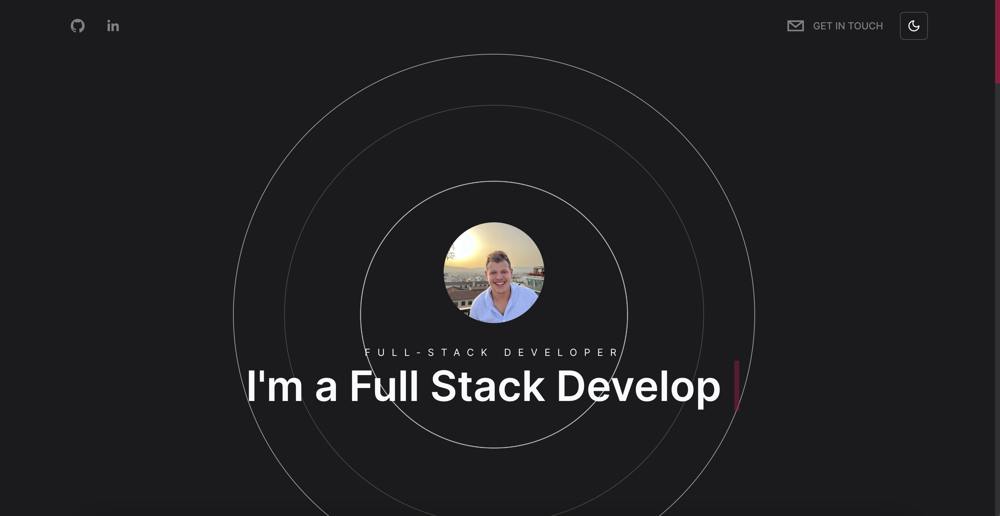

# Omer Naveh's Portfolio

Welcome to the source code repository for my personal portfolio website, crafted with Next.js and a suite of modern web technologies.

## Live Site

Check out the live site here: [Omer Naveh's Portfolio](https://next-portfolio-six-theta.vercel.app/)

## Technologies Used

This site is built with the following technologies:

- **Next.js**: A React framework.
- **Tailwind CSS**: A utility-first CSS framework.
- **Framer Motion**: A powerful library animations.
- **React Hook Form**: Performant, flexible, and extensible forms with validation.
- **Typescript**: for static type-checking.

## Screenshot



## Building and Running

To get started with the development server:

```bash
npm install
npm run dev
```

For production builds and deployment:

```bash
npm run build
npm start
```
